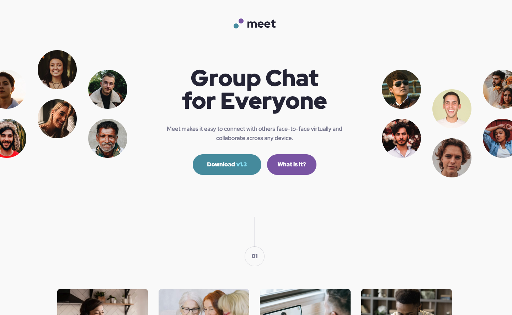

# Frontend Mentor - Meet landing page solution

This is a solution to the [Meet landing page challenge on Frontend Mentor](https://www.frontendmentor.io/challenges/meet-landing-page-rbTDS6OUR). Frontend Mentor challenges help you improve your coding skills by building realistic projects.

## Table of contents

- [Overview](#overview)
  - [The challenge](#the-challenge)
  - [Screenshot](#screenshot)
  - [Links](#links)
- [My process](#my-process)
  - [Built with](#built-with)
  - [What I learned](#what-i-learned)
  - [Continued development](#continued-development)
- [Author](#author)
- [Acknowledgments](#acknowledgments)

## Overview

### The challenge

Users should be able to:

- View the optimal layout depending on their device's screen size
- See hover states for interactive elements

### Screenshot

### Links

- Solution URL: [Add solution URL here](https://your-solution-url.com)
- Live Site URL: [Here](https://nv-meet-landing-page.netlify.app/)

## My process

### Built with

- Semantic HTML5 markup
- SASS/SCSS
- Flexbox
- CSS Grid
- Mobile-first workflow

### What I learned

### Continued development

## Author

- Portfolio - [Nate Valline](https://natevalline.dev)
- Frontend Mentor - [@nvalline](https://www.frontendmentor.io/profile/nvalline)
- LinkedIn - [Nate Valline](https://www.linkedin.com/in/nvalline)

## Acknowledgments

Gabriel Tertulino's question in the Help channel of Discord helped me figure out the solution to the card layout using CSS Grid.
